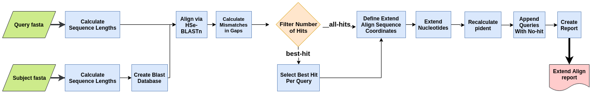

ExtendAlign
===========
ExtendAlign is a tool, implemented with Nextflow, that combines the strength of a multi-hit local alignment,
and also the refinement provided by a query-based end-to-end alignment in reporting accurately the number of matches and mismatches.

---

### Workflow overview


---

#### Features
**- v 0.2.2**

* ExtandAlign supports DNA, RNA, or DNA  vs RNA alignments.
* Results include information about unaligned queries.
* ExtendAlign percent identity recalculation is reported relative to query length.
* Easy integration with SGE or Condor Cluster environments.
* Scalability and reproducibility via a Nextflow-based framework.

---

## Requirements
#### Compatible OS*:
* [Ubuntu 16.04 LTS](http://releases.ubuntu.com/16.04/)

\* ExtendAlign may run in other UNIX based OS and versions, but testing is required.

#### Software:
| Requirement | Version  | Required Commands * |
|:---------:|:--------:|:-------------------:|
| [Bedtools](https://bedtools.readthedocs.io/en/latest/content/installation.html) | v2.25.0 | bedtools |
| [BLAST](https://www.ncbi.nlm.nih.gov/books/NBK52640/) | 2.2.31+ | makeblastdb , blastn |
| [Nextflow](https://www.nextflow.io/docs/latest/getstarted.html) | 19.01 | nextflow |
| [Plan9 port](https://github.com/9fans/plan9port) | Latest (as of 10/10/2019 ) | mk ** |

\* These commands must be accessible from your `$PATH` (*i.e.* you should be able to invoke them from your command line).  

\** Plan9 port builds many binaries, but you ONLY need the `mk` utility to be accessible from your command line.

---

### Installation
Download ExtendAlign from Github repository:  
```
git clone https://github.com/Flores-JassoLab/ExtendAlign
```

---

#### Test
To run the basic pipeline test:

Execute:
```
./runtest.sh
```

Your console will be filled with the Nextflow log for the run; after every process has been submitted, the following message will appear:
```
======
 Extend Align: Basic pipeline TEST SUCCESSFUL
======
```

The ExtendAlign results for the test data will be crated at the following file:
```
test/results/Extend_Align_results/sample_query_EA_report.tsv
```

---

### Usage
To run ExtendAlign go to the pipeline directory and execute the following:
```
nextflow run extend_align.nf --query_fasta <path to input 1> --subject_fasta <path to input 2> [--output_dir path to results ]
[--number_of_hits all|best] [--blastn_threads int_value] [--blastn_strand both|plus|minus]
[--blastn_max_target_seqs int_value] [--blastn_evalue real_value] [-profile sge|condor] [-resume]
```

For information about options and parameters, run:
```
nextflow run extend_align.nf --help
```

---

### Cluster integration
For scalability, this pipeline uses the executor component from Nextflow, as described [here](https://www.nextflow.io/docs/latest/executor.html);
especifically, we use the [SGE](https://www.nextflow.io/docs/latest/executor.html#sge) and [HTCondor](https://www.nextflow.io/docs/latest/executor.html#htcondor)
integration capabilities to manage process distribution and computational resources.

The _config_profiles/sge.config_ and/or _config_profiles/condor.config_ must be properly configured before launching cluster runs.
This configuration files define variables regarding queue, parallelization environments and resources requested by every process in the pipeline.  

For information about the `-profile sge|condor` option, run:
```
nextflow run extend_align.nf --help
```

---

### Pipeline Inputs
1. A query fasta file with `.fa`, `.fna` or `.fasta` extension.  

Example line(s):
```
>hsa-let-7a-5p.MIMAT0000062
UGAGGUAGUAGGUUGUAUAGUU
```

2. A subject fasta file with `.fa`, `.fna` or `.fasta` extension.  

Example line(s):
```
>mmu-let-7a-1.MI0000556
UUCACUGUGGGAUGAGGUAGUAGGUUGUAUAGUUUUAGGGUCACACCCACCACUGGGAGAUAACUAUACAAUCUACUGUCUUUCCUAAGGUGAU
```

### Pipeline Results
1. An ExtendAlign analysis summary, in TSV format.  

Example line(s):
```
query_name subject_name query_length EA_alignment_length EA_total_mismatch EA_total_match EA_pident blastn_pident
hsa-miR-1226-5p.MIMAT0005576 mmu-mir-6927.MI0022774 26 26 6 20 76.9231 76.923
hsa-miR-8083.MIMAT0031010 NO_HIT . . . 0 . .
```

**Note(s):**
* For this example, TABs were replaced with white spaces.
* Do note the difference between the `hsa-miR-1226-5p.MIMAT0005576` hit and the `hsa-miR-8083.MIMAT0031010` **NO_HIT** line.

#### Output File Column Descriptions:
`query_name`: Name or ID of the sequence used as query for alignment.  
`subject_name`: Name or ID of the sequence where a hit was found.  
`query_length`: Length of the query.  
`EA_alignment_length`: Number of query nucleotides included in the extended alignment.  
`EA_total_mismatch`: Number of mismatches found in the extended alignment.  
`EA_total_match`: Number of matches found in the extended alignment.  
`EA_pident`: ExtendAlign recalculated percent identity.  
`blastn_pident`: Original `HSe-blastn` percent identity.  

---

### Citation
If you find ExtendAlign helpful for your research, please include the following citation in your work:  

* Flores-Torres, M. *et al.* (2018) ExtendAlign: a computational algorithm for delivering multiple, local end-to-end alignments.

Preprint version can be found at:
<https://www.biorxiv.org/content/early/2018/12/08/475707>   

#### References

Under the hood ExtendAlign implements some widely known tools. Please include the following ciations in your work:

* Camacho, C., Coulouris, G., Avagyan, V., Ma, N., Papadopoulos, J., Bealer, K., & Madden, T. L. (2009). BLAST+: architecture and applications. BMC bioinformatics, 10(1), 421.

* Quinlan, A. R., & Hall, I. M. (2010). BEDTools: a flexible suite of utilities for comparing genomic features. Bioinformatics, 26(6), 841-842.

* Di Tommaso, P., Chatzou, M., Floden, E. W., Barja, P. P., Palumbo, E., & Notredame, C. (2017). Nextflow enables reproducible computational workflows. Nature biotechnology, 35(4), 316.

---

### Contact
If you have questions, requests, or bugs to report, please open an [issue](https://github.com/Flores-JassoLab/ExtendAlign/issues), or email
<iaguilaror@gmail.com>

#### Dev Team
Israel Aguilar-Ordonez <iaguilaror@gmail.com>   
Mariana Flores-Torres <mariana.flo.tor@gmail.com>  
Joshua I. Haase-Hernández <jihaase@inmegen.gob.mx>  
Karla Lozano-Gonzalez <klg1219sh@gmail.com>   
Fabian Flores-Jasso <cfflores@inmegen.gob.mx>  
